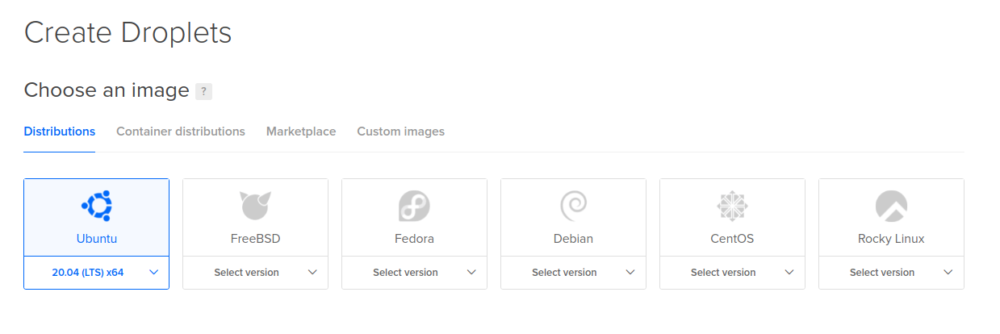
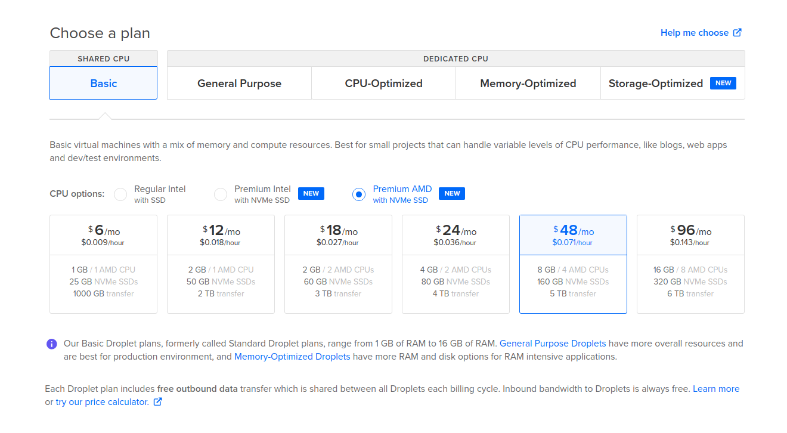
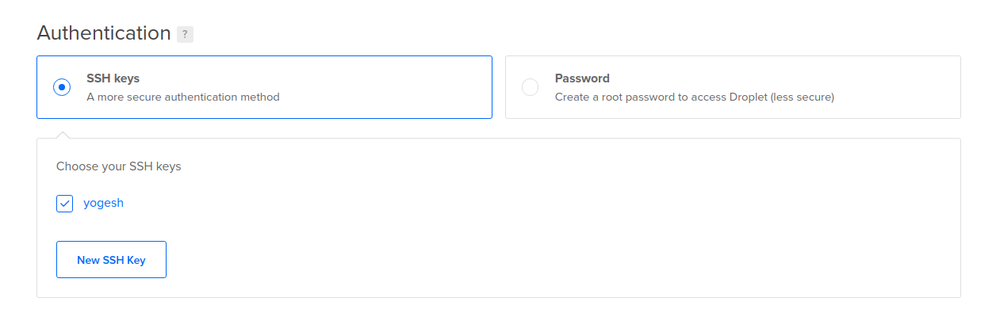

# Installing reNgine on VPS

The installation steps for installing reNgine on any VPS should be very similar. An example using DigitalOcean is given below.

Join DigitalOcean using my [referral link](https://m.do.co/c/e353502d19fc) your profit is **$100** and I get $25 DO credit. This will help me test reNgine on VPS before I release any major features.

- Login to your DigitalOcean account.
- Click on Create on top right corner and Click on Droplets


- Choose Ubuntu



- Depending on your monthly budget, choose a plan.

Consider atlease 80GB NVMe, 4GB RAM and 2 CPU.

Recommended 160GB, 8GB RAM and 4 CPU.



- Choose Authentication of your choice. I recommend using SSH Keys, you may also use password.



- Click on Create Droplet


- Your VPS has been created


**Please note down the IP address. You will need this IP address to ssh into.**

- Open your terminal or putty and ssh into this IP address

```
ssh root@vps_ip
```

Once you are logged into your VPS, follow [Quick Installation instructions](quick-install.md)
